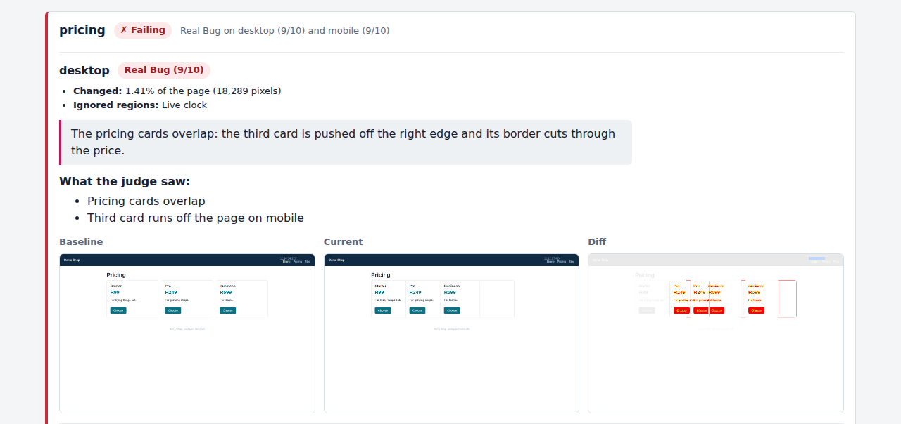
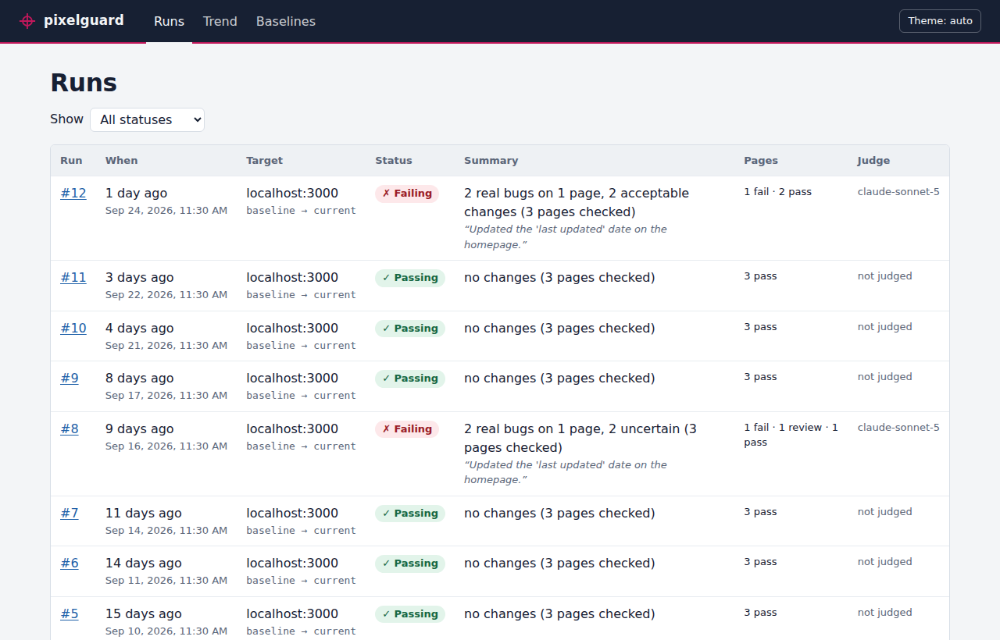
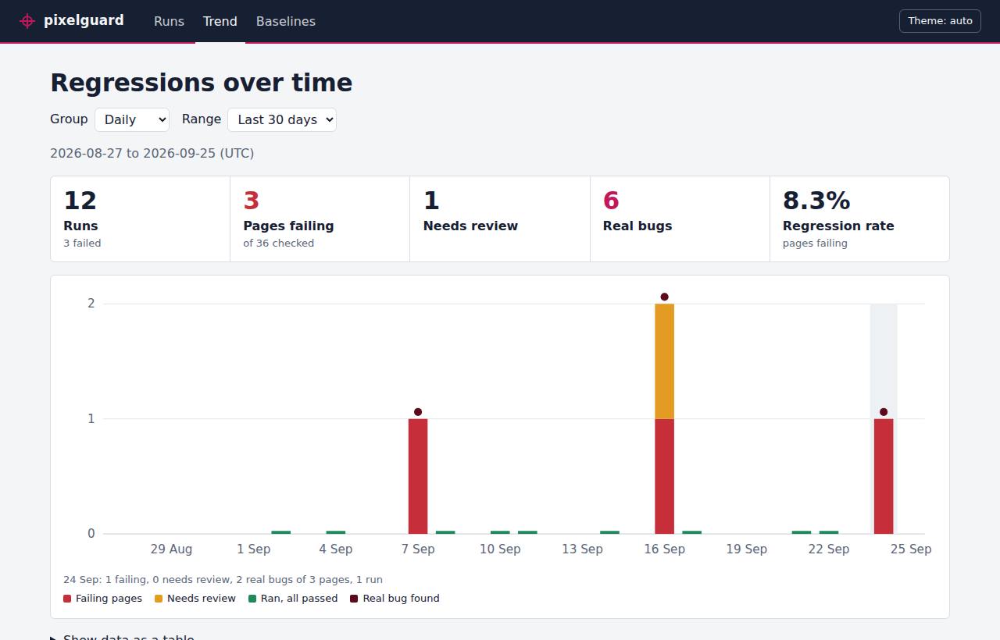

# pixelguard

**AI-powered visual regression testing.** pixelguard screenshots your site before and after a change, compares the screenshots pixel by pixel, and asks a vision-capable AI model whether each difference is a **real bug** or an **acceptable change**. You review what matters instead of every pixel that moved.



- [Why pixelguard](#why-pixelguard)
- [Quick start](#quick-start)
- [The AI judge](#the-ai-judge)
- [Ignoring dynamic content](#ignoring-dynamic-content)
- [The dashboard](#the-dashboard)
- [Accepting changes](#accepting-changes)
- [Using it in CI](#using-it-in-ci)
- [Command reference](#command-reference)
- [Configuration](#configuration)
- [Run with Docker](#run-with-docker)
- [Project structure](#project-structure)

## Why pixelguard

Classic visual regression tools flag every pixel difference: a date that changed, a rotating banner, anti-aliasing noise. Teams drown in false positives and stop looking. pixelguard adds a judgment step on top of the pixel diff. It looks at _what_ changed, reads your note about what the build was meant to change, and says whether a person needs to care, with an explanation.

It works in four steps:

1. **Capture:** screenshots of your pages at several screen sizes (Playwright + Chromium).
2. **Diff:** a pixel comparison of each pair, with a diff image and the percentage changed (pixelmatch).
3. **Judge:** each changed screenshot goes to the AI model, which answers Real Bug, Acceptable Change or Uncertain, with a confidence score and reasons.
4. **Report:** a pass, review or fail result per page in the terminal, a Markdown report and the dashboard, which keeps the history and lets you accept intended changes as the new baseline.

## Quick start

You need **Node 20 or newer**, or just [Docker](#run-with-docker).

```bash
git clone https://github.com/Kamogelo-Skhosana/pixelguard.git
cd pixelguard
npm install
npx playwright install --with-deps chromium

cp .env.example .env
```

In `.env`, set the site to test and the pages to check:

```bash
TARGET_BASE_URL=http://localhost:3000
TARGET_PAGES=/,/pricing,/blog
```

Capture a baseline, make your change, capture again and compare:

```bash
npm run pixelguard -- capture --tag baseline
# ...deploy or change your site...
npm run pixelguard -- capture --tag current
npm run pixelguard -- diff --baseline baseline --current current
```

This is what it looks like against the bundled demo shop, where the new version changed a date on the home page and broke the pricing layout:

```
$ npm run pixelguard -- capture --tag baseline
Using 1 known dynamic region(s) from pixelguard.regions.json
Capturing 3 page(s) x 2 viewport(s) from http://localhost:3000 as "baseline"...
  ✓ /  desktop, mobile
  ✓ /pricing  desktop, mobile
  ✓ /blog  desktop, mobile

Saved 6 screenshot(s) to screenshots/baseline

$ npm run pixelguard -- diff --baseline baseline --current current
Using 1 known dynamic region(s) from pixelguard.regions.json
Comparing "baseline" with "current"...

Page     Viewport  Changed   Pixels  Status     Notes
home     desktop    <0.01%       41  CHANGED    ignored: Live clock
home     mobile      0.01%       41  CHANGED    ignored: Live clock
pricing  desktop     1.41%   18,289  CHANGED    ignored: Live clock
pricing  mobile     54.68%  415,556  CHANGED    width 390px -> 836px, height 909px -> 844px; ignored: Live clock
blog     desktop        0%        0  unchanged  ignored: Live clock
blog     mobile         0%        0  unchanged  ignored: Live clock

4 of 6 screenshots changed. Biggest change: pricing / mobile (54.68%)

Diff images: diffs/baseline-vs-current
Saved as run #1 in ./pixelguard.db
```

The pixel diff can't tell the harmless date change from the broken layout. That's the AI judge's job.

### Try the demo

To see the whole flow without a site of your own:

```bash
npm run demo
```

This starts the demo shop and captures it. It then switches the shop to version 2 (the date change plus the layout bug), captures again, diffs, and writes `demo-output/report.md`. With `LLM_API_KEY` set, the judge runs too.

## The AI judge

Add your Anthropic API key to `.env` and pass `--judge`:

```bash
LLM_API_KEY=sk-ant-...
LLM_MODEL=claude-sonnet-5   # the default
```

```bash
npm run pixelguard -- diff --baseline baseline --current current --judge \
  --change "Updated the 'last updated' date on the homepage" --report report.md
```

Only changed screenshots are sent to the model. Unchanged ones cost nothing. The output gains a verdict per screenshot and a result per page:

```
Judging 4 changed screenshot(s) with claude-sonnet-5...
  home / desktop: Acceptable Change (9/10)
  home / mobile: Acceptable Change (9/10)
  pricing / mobile: Real Bug (9/10)
  pricing / desktop: Real Bug (9/10)
...
Pages:
  ✗ pricing  FAIL  Real Bug on desktop (9/10) and mobile (9/10)
  ✓ home     PASS  Acceptable changes on desktop and mobile
  ✓ blog     PASS  No changes

✗ FAIL: 2 real bugs on 1 page, 2 acceptable changes (3 pages checked)
```

<sub>Output from the demo with the scripted judge that pixelguard's own end-to-end test uses. A real model gives the same kind of answer in its own words.</sub>

**Tell it what changed.** The judge is far better at spotting mistakes when it knows what the build was _supposed_ to change. Pass `--change "…"`, `--change-file notes.txt`, or set `PIXELGUARD_CHANGE` (handy in CI, for example with the pull request title).

**How verdicts become page results:**

| Verdict / situation                                                                       | Page result  |
| ----------------------------------------------------------------------------------------- | ------------ |
| Real Bug on any screenshot                                                                | ✗ **FAIL**   |
| Uncertain, the judge failed, a change wasn't judged, or a screenshot couldn't be compared | ? **REVIEW** |
| Only Acceptable Changes or no changes                                                     | ✓ **PASS**   |

A run's result is its worst page's. `--report report.md` writes a Markdown report with the verdicts, explanations and screenshots side by side, which reads well on GitHub. See the [sample report](examples/sample-report/report.md).

## Ignoring dynamic content

Clocks, ads, carousels and cookie banners change on every capture. List them in `pixelguard.regions.json` (copy [`pixelguard.regions.example.json`](pixelguard.regions.example.json)):

```json
{
  "regions": [
    {
      "page": "/",
      "label": "Footer year",
      "kind": "timestamp",
      "selector": "#copyright",
      "handling": "ignore"
    },
    {
      "page": "*",
      "viewport": "mobile",
      "label": "Cookie banner",
      "kind": "banner",
      "rect": { "x": 0, "y": 0, "width": 390, "height": 80 },
      "handling": "ignore"
    },
    {
      "page": "/",
      "label": "Hero carousel",
      "kind": "carousel",
      "selector": ".hero-slider",
      "handling": "inform"
    }
  ]
}
```

- Give each region either a CSS `selector` (measured on the page at capture time) or a fixed pixel `rect`.
- `"page": "*"` matches every page, and `viewport` limits a region to one screen size.
- `"handling": "ignore"` masks the region out of the pixel diff completely.
- `"handling": "inform"` keeps it in the diff but tells the judge it's expected to change.
- `kind` is one of `timestamp`, `ad`, `carousel`, `animation`, `banner`, `user-content`, `live-data` or `other`.

## The dashboard

Every `diff` run is saved to `pixelguard.db`. Browse them with:

```bash
npm run pixelguard -- dashboard        # http://127.0.0.1:8100
```



- **Runs:** every run, newest first, filterable by status. Open one to see each page's verdict, the judge's explanation and the baseline, current and diff screenshots side by side (the image at the top of this page).
- **Trend:** failing and needs-review pages per day, week or run, with real bugs marked, so you can see whether things are getting better or worse.
- **Baselines:** every baseline version, how it was made, and a one-click restore.
- Light and dark themes, following your system setting.



The dashboard only listens on your own computer by default, because it can change baselines and has no login. To share it with your team, start it with `--read-only` and put it behind a password. [docs/DEPLOYMENT.md](docs/DEPLOYMENT.md) covers running it as a service, reverse proxies, backups and upgrades.

## Accepting changes

When a diff shows a change you meant to make, make it the new baseline. In the dashboard, use **Accept all pages** on the run's page, or **Accept this page** on a single page. From the command line:

```bash
npm run pixelguard -- accept --from current                    # everything
npm run pixelguard -- accept --from current --pages /pricing   # just some pages
```

The baseline is swapped in safely and is never left half-replaced. A capture with failed screenshots is refused unless you add `--force`, which accepts just the screenshots that worked. Every accepted baseline is kept, so you can look back or roll back:

```bash
npm run pixelguard -- baseline history      # every version, newest first
npm run pixelguard -- baseline restore 3    # make version 3 the baseline again
```

## Using it in CI

Exit codes are made for CI:

| Code | Meaning                                                                                        |
| ---- | ---------------------------------------------------------------------------------------------- |
| `0`  | Success: nothing to fail on                                                                    |
| `1`  | `--fail-on-change` and a screenshot changed, or `--fail-on-bug` and the judge found a Real Bug |
| `2`  | Something went wrong (bad settings, a capture failed completely, a missing tag…)               |

Use `--judge --fail-on-bug` so only real bugs fail the build. Harmless changes still show up in the report without blocking anyone. A GitHub Actions job that compares production with a pull request's preview deployment:

```yaml
name: Visual check
on: pull_request

jobs:
  pixelguard:
    runs-on: ubuntu-latest
    env:
      TARGET_PAGES: /,/pricing,/blog
    steps:
      - uses: actions/checkout@v4
        with:
          repository: Kamogelo-Skhosana/pixelguard
      - uses: actions/setup-node@v4
        with:
          node-version: 20
          cache: npm
      - run: npm ci
      - run: npx playwright install --with-deps chromium

      - name: Capture production (baseline)
        run: npm run pixelguard -- capture --tag baseline
        env:
          TARGET_BASE_URL: https://www.example.com
      - name: Capture the preview (current)
        run: npm run pixelguard -- capture --tag current
        env:
          TARGET_BASE_URL: ${{ vars.PREVIEW_URL }}
      - name: Compare and judge
        run: npm run pixelguard -- diff --baseline baseline --current current --judge --fail-on-bug --report report.md
        env:
          TARGET_BASE_URL: ${{ vars.PREVIEW_URL }}
          LLM_API_KEY: ${{ secrets.ANTHROPIC_API_KEY }}
          PIXELGUARD_CHANGE: ${{ github.event.pull_request.title }}

      - uses: actions/upload-artifact@v4
        if: always()
        with:
          name: pixelguard-report
          path: |
            report.md
            screenshots/
            diffs/
```

## Command reference

Run any command with `--help` for the same information. From a clone, prefix commands with `npm run pixelguard --`. After `npm run build`, `node dist/cli.js` works too.

**`capture --tag <name>`**: screenshots every page in `TARGET_PAGES` at every viewport in `VIEWPORTS` and stores them under `screenshots/<name>/`. If every screenshot fails, the previous capture with that tag is kept.

**`diff --baseline <tag> --current <tag> [options]`**

| Option                 | What it does                                                                             |
| ---------------------- | ---------------------------------------------------------------------------------------- |
| `--judge`              | Ask the AI judge about each changed screenshot (needs `LLM_API_KEY`)                     |
| `--change <text>`      | What this build was meant to change (or set `PIXELGUARD_CHANGE`)                         |
| `--change-file <path>` | Read that description from a file                                                        |
| `--report <path>`      | Write a Markdown report (with verdicts when used with `--judge`)                         |
| `--output <path>`      | Write the raw results as JSON                                                            |
| `--threshold <0-1>`    | How different a pixel's colour must be to count (default `0.1`; higher = less sensitive) |
| `--fail-on-change`     | Exit 1 if any screenshot changed                                                         |
| `--fail-on-bug`        | With `--judge`: exit 1 if the judge found a Real Bug                                     |
| `--no-save`            | Don't save this run to the database                                                      |

**`accept --from <tag> [--to baseline] [--pages /,/pricing] [--force]`**: makes a capture (or some of its pages) the new baseline.

**`baseline history [--tag baseline]`** and **`baseline restore <version> [--tag baseline]`**: list baseline versions, or bring an old one back.

**`dashboard [--port 8100] [--host 127.0.0.1] [--read-only]`**: starts the web dashboard. `npm start` runs the built version.

## Configuration

All settings live in `.env` (see [`.env.example`](.env.example)). Environment variables work too and take precedence.

| Setting                    | Default                                           | What it's for                                                     |
| -------------------------- | ------------------------------------------------- | ----------------------------------------------------------------- |
| `TARGET_BASE_URL`          | _(required)_                                      | The site to test, e.g. `http://localhost:3000`                    |
| `TARGET_PAGES`             | `/`                                               | Comma-separated page paths                                        |
| `VIEWPORTS`                | desktop 1440×900, tablet 768×1024, mobile 390×844 | Screen sizes, e.g. `desktop:1440x900,mobile:390x844`              |
| `REGIONS_FILE`             | `pixelguard.regions.json`                         | [Dynamic regions](#ignoring-dynamic-content) to ignore or explain |
| `OUTPUT_DIR`               | `screenshots`                                     | Where captures are stored                                         |
| `DIFF_DIR`                 | `diffs`                                           | Where diff images are written                                     |
| `LLM_API_KEY`              | _(empty)_                                         | Anthropic API key, needed for `--judge`                           |
| `LLM_MODEL`                | `claude-sonnet-5`                                 | Vision-capable model the judge uses                               |
| `DATABASE_URL`             | `sqlite:./pixelguard.db`                          | Where runs are saved                                              |
| `DASHBOARD_HOST`           | `127.0.0.1`                                       | `0.0.0.0` to allow other computers                                |
| `DASHBOARD_PORT`           | `8100`                                            | Dashboard port                                                    |
| `DASHBOARD_READ_ONLY`      | `false`                                           | `true` turns off accepting and restoring in the dashboard         |
| `PIXELGUARD_CHANGE`        | _(empty)_                                         | Default for `diff --change`                                       |
| `PIXELGUARD_CHROMIUM_PATH` | _(Playwright's)_                                  | Use a specific Chromium or Chrome binary                          |

Invalid settings are reported all at once, with what to fix, before anything runs.

## Run with Docker

The image has everything pixelguard needs, Chromium included, so you don't need Node or Playwright on your computer.

```bash
cp .env.example .env                 # set TARGET_BASE_URL (and LLM_API_KEY for --judge)
docker compose up -d --build         # dashboard on http://localhost:8100

docker compose run --rm pixelguard capture --tag baseline
docker compose run --rm pixelguard capture --tag current
docker compose run --rm pixelguard diff --baseline baseline --current current --judge
```

- Screenshots, diffs and the database are kept in `./pixelguard-data`, shared by the dashboard and the commands.
- The dashboard is only reachable from your own computer. To share it on your network, change the port to `"8100:8100"` in `docker-compose.yml`, and consider `DASHBOARD_READ_ONLY=true`.
- To test a site running on your computer, use `TARGET_BASE_URL=http://host.docker.internal:3000`. Inside the container, `localhost` means the container itself.
- On Linux, `./pixelguard-data` must be writable by user id 1000 (the container's user). It is if you cloned the repo as the usual first user. Otherwise, run `sudo chown 1000 pixelguard-data`.
- Without Compose: `docker build -t pixelguard .`, then `docker run --rm -p 127.0.0.1:8100:8100 --env-file .env -e DASHBOARD_HOST=0.0.0.0 -v "$PWD/pixelguard-data:/data" pixelguard`.

## Project structure

```
pixelguard/
├── src/
│   ├── capture/          # Playwright screenshot capture
│   ├── diff/             # Pixel diffing (pixelmatch), diff images
│   ├── judge/            # AI judge: prompts, API client, verdicts, dynamic regions
│   ├── report/           # Console, Markdown and JSON reports; saving runs to SQLite
│   ├── dashboard/        # Dashboard server, API, baseline accept/history
│   ├── cli.ts            # Command-line interface
│   ├── commands.ts       # What each command does
│   └── config.ts         # Settings from .env
├── public/               # Dashboard frontend (plain HTML/CSS/JS, no build step)
├── tests/                # Unit, API, browser and end-to-end tests (Vitest)
├── scripts/              # npm run demo; diff test fixture generator
├── examples/
│   ├── demo-site/        # Demo shop with a harmless change and a real bug
│   └── sample-report/    # Example Markdown report
├── docs/                 # Architecture, deployment, report design, roadmap, tickets
├── Dockerfile, docker-compose.yml
└── .env.example, pixelguard.regions.example.json
```

**Built with:** TypeScript on Node 20, Playwright (Chromium), pixelmatch and pngjs, the Anthropic Messages API, SQLite (better-sqlite3), Express, zod and commander. The dashboard is plain JavaScript modules with no build step.

## Documentation

- [docs/ARCHITECTURE.md](docs/ARCHITECTURE.md): how each layer works, in detail
- [docs/DEPLOYMENT.md](docs/DEPLOYMENT.md): running and sharing the dashboard
- [docs/REPORT_TEMPLATE.md](docs/REPORT_TEMPLATE.md): design of the Markdown report
- [docs/ROADMAP.md](docs/ROADMAP.md) and [docs/TICKETS.md](docs/TICKETS.md): how the project was built, in three phases and 50 tickets
- [CONTRIBUTING.md](CONTRIBUTING.md): workflow and checks (`npm run lint`, `npm run typecheck`, `npm test`)

## License

MIT. See [LICENSE](LICENSE).
