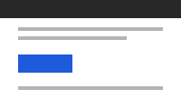
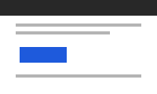
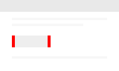
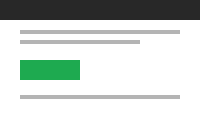
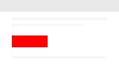
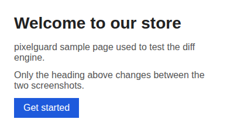
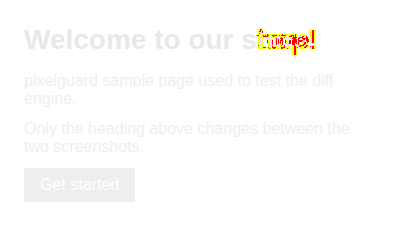

# pixelguard report

> ❌ **FAIL:** 1 real bug on 1 page, 1 uncertain, 1 not compared, 1 acceptable change (4 pages checked)

|               |                          |
| ------------- | ------------------------ |
| **Target**    | https://shop.example.com |
| **Compared**  | `baseline` → `current`   |
| **Judge**     | claude-sonnet-5          |
| **Generated** | 2026-09-25T00:45:00.000Z |

**What changed in this build:**

> Redesigned the checkout button (new green colour).

## Summary

| Screenshots           | Count |
| --------------------- | ----: |
| ❌ Real bugs          |     1 |
| ⚠️ Uncertain          |     1 |
| ⚠️ Not compared       |     1 |
| ✅ Acceptable changes |     1 |
| ✅ Unchanged          |     3 |

| Page                    | Status    | Summary                                                                          |
| ----------------------- | --------- | -------------------------------------------------------------------------------- |
| [checkout](#checkout)   | ❌ FAIL   | Real Bug on mobile (9/10)                                                        |
| [home](#home)           | ⚠️ REVIEW | Needs review: desktop Uncertain (5/10)                                           |
| [blog](#blog)           | ⚠️ REVIEW | Needs review: desktop not compared: not in "current" (removed page or viewport?) |
| [about](#passing-pages) | ✅ PASS   | No changes                                                                       |

## Failing pages

### checkout

**❌ FAIL** · _Real Bug on mobile (9/10)_

#### mobile — Real Bug (9/10)

- **Changed:** 0.83% of the page (200 pixels)

> The checkout button has shifted 5px to the right, so it is no longer aligned with the text lines above it. The developer note mentions a colour change, not a move, so this looks accidental.

**What the judge saw:**

- Checkout button moved about 5px right
- Button no longer lines up with the content column

| Baseline                                                                                                                                                            | Current                                                                                                                                                          | Diff                                                                                                      |
| ------------------------------------------------------------------------------------------------------------------------------------------------------------------- | ---------------------------------------------------------------------------------------------------------------------------------------------------------------- | --------------------------------------------------------------------------------------------------------- |
|  |  |  |

#### desktop — Acceptable Change (9/10)

- **Changed:** 5.00% of the page (1,200 pixels)

> The checkout button changed from blue to green, exactly as described in the developer note. Its size, position and label are unchanged.

**What the judge saw:**

- Checkout button colour changed from blue to green

| Baseline                                                                                                                                                             | Current                                                                                                                                                           | Diff                                                                                                         |
| -------------------------------------------------------------------------------------------------------------------------------------------------------------------- | ----------------------------------------------------------------------------------------------------------------------------------------------------------------- | ------------------------------------------------------------------------------------------------------------ |
|  |  |  |

## Pages to review

### home

**⚠️ REVIEW** · _Needs review: desktop Uncertain (5/10)_

#### desktop — Uncertain (5/10)

- **Changed:** 0.27% of the page (260 pixels)
- **Ignored regions:** Cookie banner

> The main heading changed from "Welcome to our store" to "Welcome to our shop!". The layout is intact, but the developer note only mentions the checkout button, so it's unclear whether this copy change was intended.

**What the judge saw:**

- Heading text changed from "store" to "shop!"

| Baseline                                                                                                                                                                     | Current                                                                                                                                                                   | Diff                                                                                             |
| ---------------------------------------------------------------------------------------------------------------------------------------------------------------------------- | ------------------------------------------------------------------------------------------------------------------------------------------------------------------------- | ------------------------------------------------------------------------------------------------ |
|  |  |  |

Unchanged: mobile.

### blog

**⚠️ REVIEW** · _Needs review: desktop not compared: not in "current" (removed page or viewport?)_

#### desktop — Not compared

- not in "current" (removed page or viewport?)

## Passing pages

| Page  | Summary    |
| ----- | ---------- |
| about | No changes |

---

Generated by [pixelguard](https://github.com/Kamogelo-Skhosana/pixelguard) · JSON results: `diffs.json`
